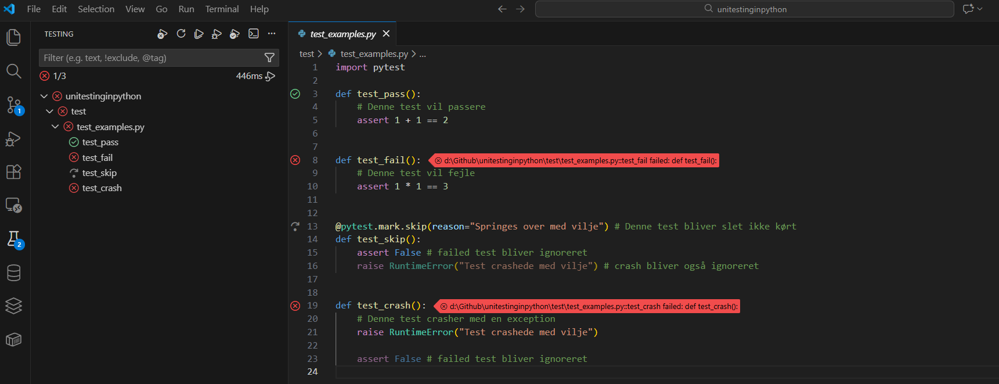
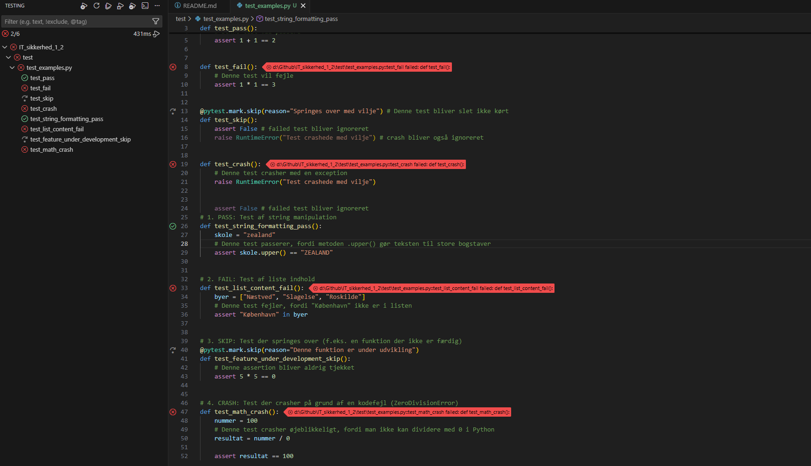
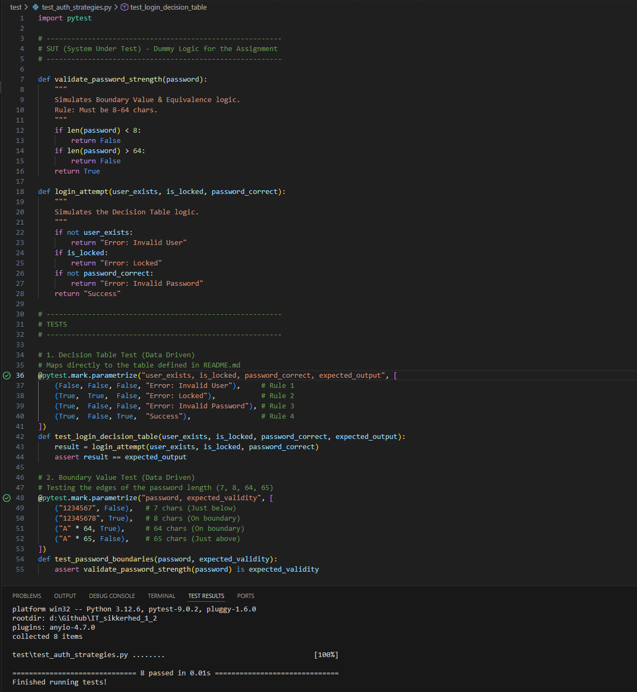
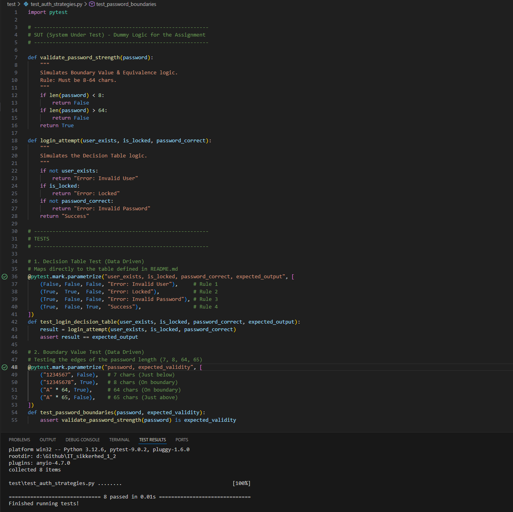
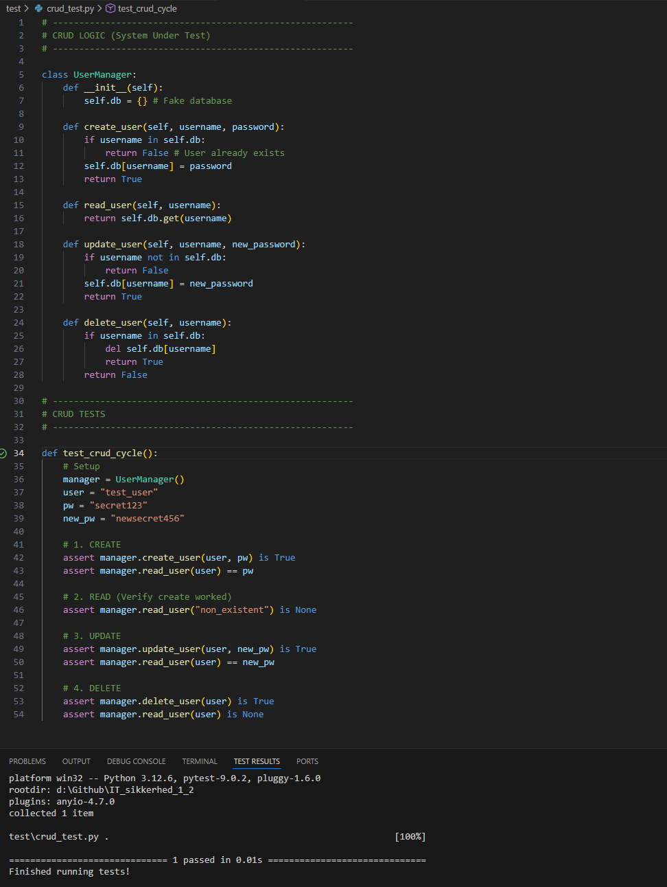
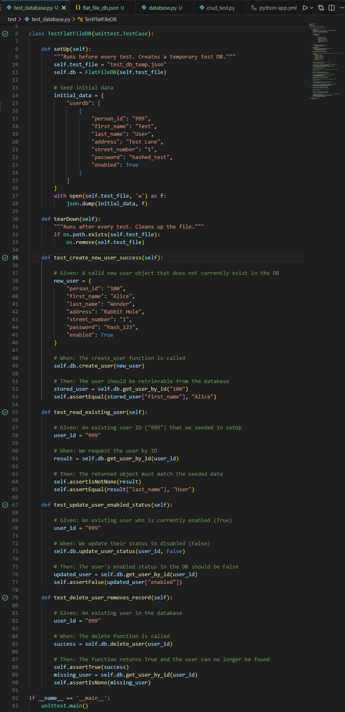

# IT-Sikkerhed Projekt

Dette er et **skoleprojekt** for Zealand, Næstved (IT-Sikkerhed).

## Om Projektet
Under construction...

## Nyttige Links
* [Zealand - Sjællands Erhvervsakademi](https://www.zealand.dk/)
* [Markdown Guide](https://www.markdownguide.org/cheat-sheet/)

## 1.0 pytest

## 1.1 my own pytest

## 2.0 Test Strategier (Opgave)
**Emne:** Login-system & Password regler

### 2.1 Ækvivalensklasser
Jeg deler input op i grupper, som systemet bør håndtere på samme måde.
* **Gyldig:** Password på 8-64 tegn, som indeholder tal og specialtegn.
* **Ugyldig:** Password på under 8 tegn.
* **Ugyldig:** Password på over 64 tegn.
* **Ugyldig:** Mangler specialtegn eller tal.

### 2.2 Grænseværditest
Her tester jeg lige præcis der, hvor koden skifter fra "godkendt" til "afvist" (længden på passwordet).
* **7 tegn:** Fejler (Lige under grænsen)
* **8 tegn:** Godkendes (På grænsen)
* **64 tegn:** Godkendes (På grænsen)
* **65 tegn:** Fejler (Lige over grænsen)

### 2.3 CRUD(L)
Hvordan de klassiske operationer ser ud i mit sikkerheds-emne:
* **C (Create):** Opret ny bruger (her skal password hashes før det gemmes).
* **R (Read):** Log ind (systemet tjekker om input matcher det gemte hash).
* **U (Update):** Skift password eller opdater profil.
* **D (Delete):** Slet bruger (sletning af data fra databasen).
* **L (List):** Vis log-filer over login-forsøg (for at spotte angreb).

### 2.4 Cycle Process Test
En test af "livscyklussen" for en brugerkonto:
1.  **Status:** Konto er aktiv.
2.  **Handling:** 3 forkerte login forsøg -> **Status:** Konto låses.
3.  **Handling:** Admin låser op -> **Status:** Konto er aktiv igen.
4.  **Handling:** Password udløber -> **Status:** Afventer nyt password.

### 2.5 Test Pyramiden
Hvor mine tests hører hjemme:
* **Unit Tests (Bunden):** Min PyTest kode. Tjekker logikken (fx "er password langt nok?"). Det går hurtigt.
* **Integration Tests (Midten):** Tjekker om "Opret Bruger" faktisk gemmer det rigtigt i databasen.
* **UI/E2E Tests (Toppen):** En test der åbner en browser og klikker "Log ind" som en rigtig bruger.

### 2.6 Decision Table Test
Logikken for min login-funktion testet i et skema:

| Regel | Findes bruger? | Er konto låst? | Rigtigt password? | Forventet Resultat |
| :--- | :--- | :--- | :--- | :--- |
| 1 | Nej | - | - | Fejl: Ukendt bruger |
| 2 | Ja | Ja | - | Fejl: Konto låst |
| 3 | Ja | Nej | Nej | Fejl: Forkert kode |
| 4 | Ja | Nej | Ja | Succes: Logget ind |

### 2.7 Security Gates
Hvor i mit workflow ville jeg lægge disse tests?
* **Pull Request (Før koden godkendes):** Her køres **Unit Tests** (min PyTest). Hvis de fejler, må koden ikke komme videre.
* **Deployment (Før det går live):** Her køres de tungere tests, som sikrer at databasen og hele flowet virker sammen.

## 3 DB Unit testing / flat_db_file

### 3.1 Hvorfor Flat File DB?
Jeg har valgt en flat_file_db (JSON) til denne opgave, fordi:

Simpel opsætning: Kræver ingen server (som SQL/NoSQL), men kun en fil.

Læsbarhed: Data gemmes i JSON, så det er nemt for mennesker at læse og debugge direkte i filen.

Portabilitet: Databasen er blot en fil, der kan flyttes sammen med koden.

### 3.2 Test Design
Jeg har designet mine tests, så de dækker hele CRUD-livscyklussen (Create, Read, Update, Delete) for en bruger.

Naming: Beskrivende testnavne (fx test_create_new_user_success).

BDD Struktur: Jeg bruger kommentarerne Given (før-situation), When (handling) og Then (forventet resultat) i koden.

Risikovurdering: Hver test har en kommentar om Risikoen, hvis testen fejler (fx "Admin kan ikke låse brugere").

### NOTE til 3 (DB TEST), risikoen for hvad der sker er skrevet ind i selve unit testene. 

### Screenshots

## 1. Auth Test 1

## 1. Auth Test 2

## 2. CRUD Tests

## 3. DB unit testing

## 4. Security
