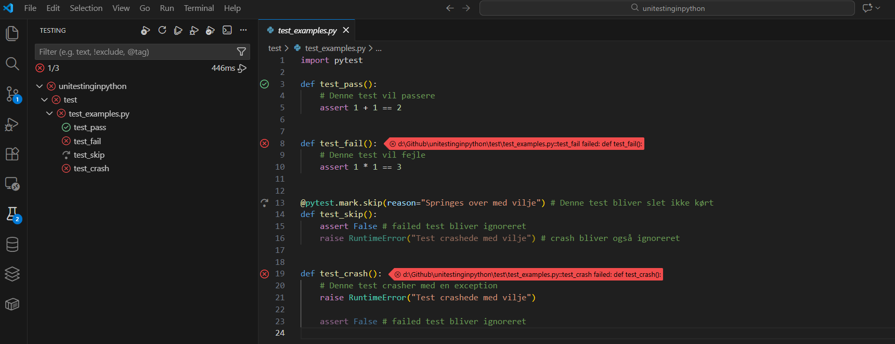
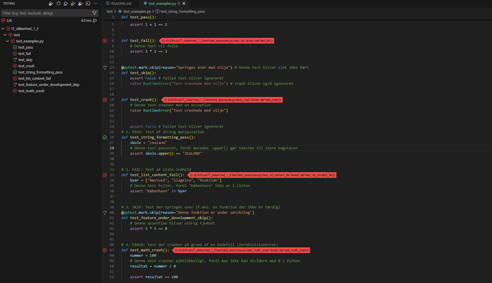
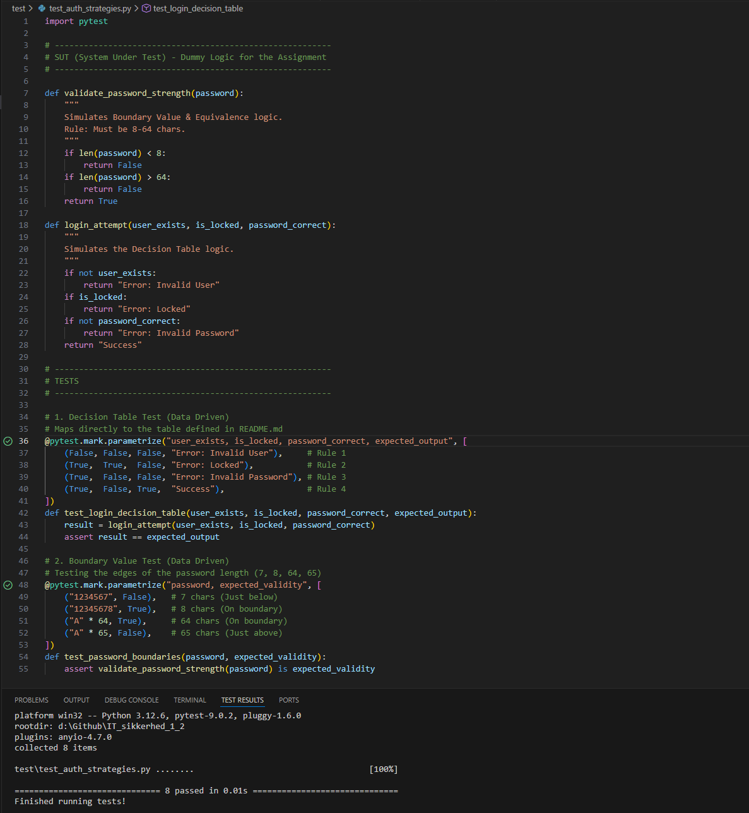
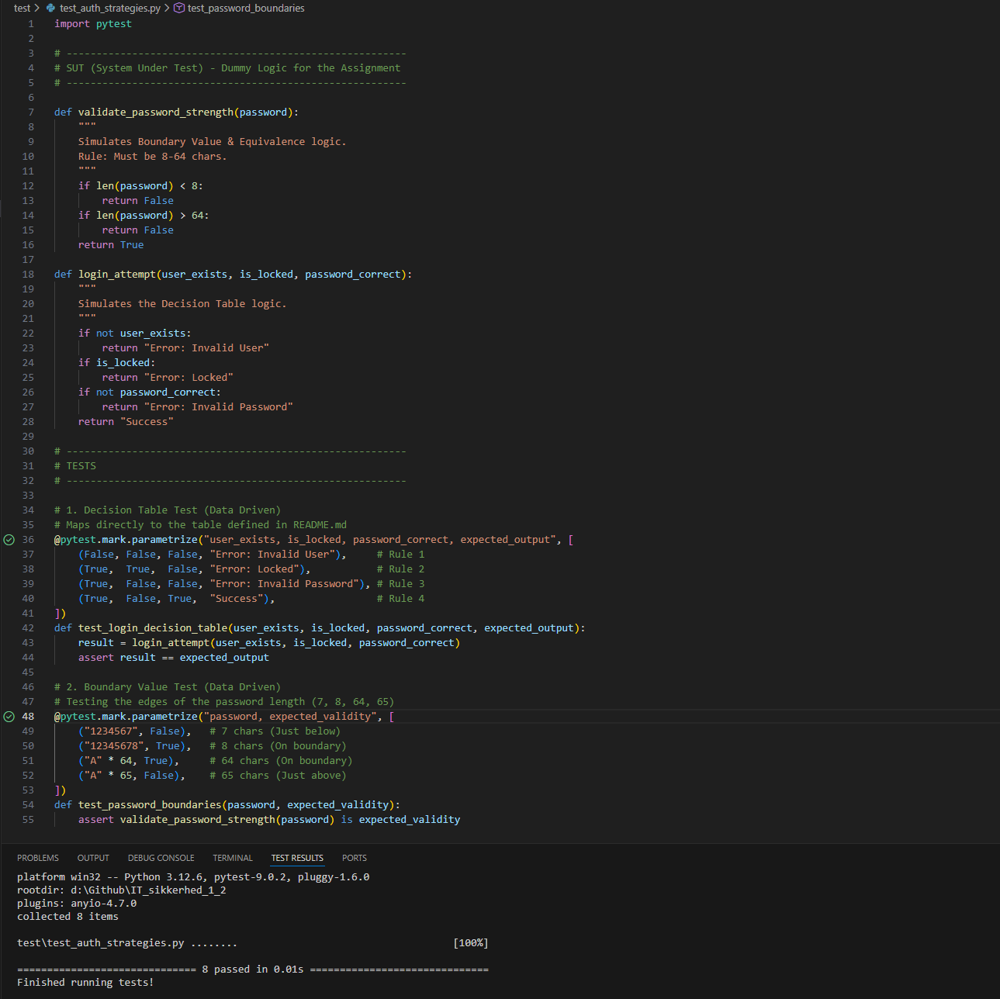
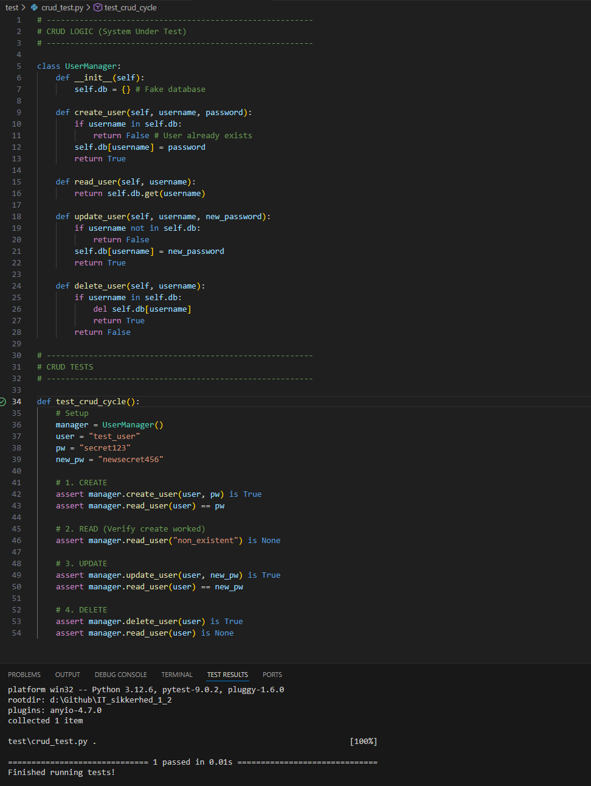
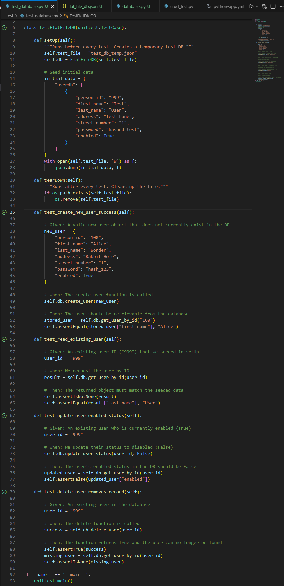
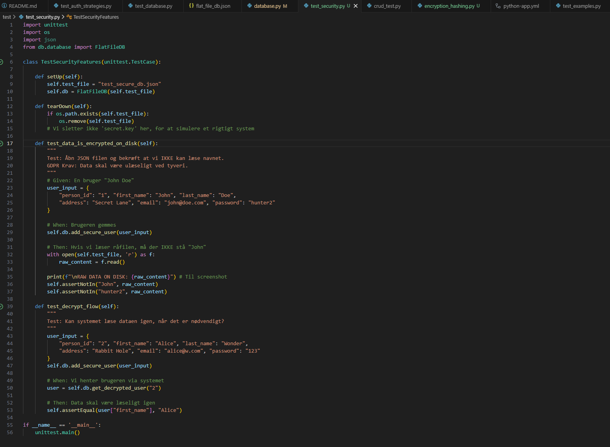
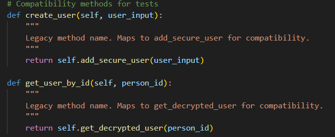
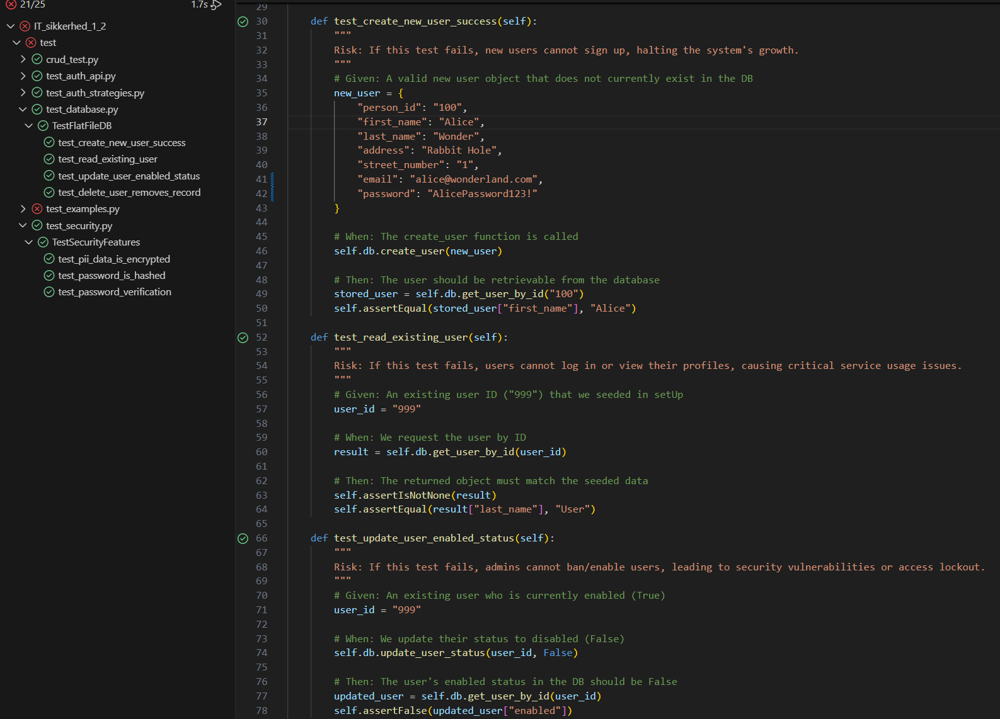

# IT-Security Project

This is a **school project** for Zealand, Næstved (IT-Security).

## About the Project
This project demonstrates the development of a secure backend prototype with a focus on Security by Design and GDPR compliance.

The goal is to build a user database from scratch (without using pre-built frameworks) to demonstrate a deep understanding of how data is protected "under the hood".

Core project points:

Secure Coding: Implementation of AES encryption to protect personal data (PII) and PBKDF2 with salt for secure password hashing.

Test-Driven Development (TDD): Extensive use of pytest to ensure code quality through unit tests, boundary value analysis, and decision tables.

Architecture: Building a custom flat_file_db (JSON) with full CRUD functionality and built-in security layer.

Quality Assurance: Application of BDD principles (Given-When-Then) and risk analysis in test design.

This repository serves as a "Proof of Concept" for how to ensure data integrity and confidentiality in a modern development environment.

## Useful Links
* [Zealand - Zealand Business Academy](https://www.zealand.dk/)

## 1.0 pytest


## 1.1 my own pytest


## 2.0 Test Strategies (Assignment)
**Subject:** Login system & Password rules

### 2.1 Equivalence Classes
I divide input into groups that the system should handle in the same way.
* **Valid:** Password 8-64 characters that contain numbers and special characters.
* **Invalid:** Password under 8 characters.
* **Invalid:** Password over 64 characters.
* **Invalid:** Missing special characters or numbers.

### 2.2 Boundary Value Testing
Here I test exactly where the code switches from "accepted" to "rejected" (password length).
* **7 characters:** Fails (Just under limit)
* **8 characters:** Accepted (On limit)
* **64 characters:** Accepted (On limit)
* **65 characters:** Fails (Just over limit)

### 2.3 CRUD(L)
How the classic operations look in my security subject:
* **C (Create):** Create new user (password must be hashed before saving).
* **R (Read):** Log in (system checks if input matches stored hash).
* **U (Update):** Change password or update profile.
* **D (Delete):** Delete user (removal of data from database).
* **L (List):** Display login attempt logs (to detect attacks).

### 2.4 Cycle Process Test
A test of the "lifecycle" of a user account:
1.  **Status:** Account is active.
2.  **Action:** 3 failed login attempts -> **Status:** Account is locked.
3.  **Action:** Admin unlocks -> **Status:** Account is active again.
4.  **Action:** Password expires -> **Status:** Awaiting new password.

### 2.5 Test Pyramid
Where my tests belong:
* **Unit Tests (Bottom):** My PyTest code. Tests the logic (e.g. "is password long enough?"). Goes fast.
* **Integration Tests (Middle):** Checks if "Create User" actually saves it correctly in the database.
* **UI/E2E Tests (Top):** A test that opens a browser and clicks "Log in" as a real user.

### 2.6 Decision Table Test
Logic for my login function tested in a table:

| Rule | User Found? | Account Locked? | Correct Password? | Expected Result |
| :--- | :--- | :--- | :--- | :--- |
| 1 | No | - | - | Error: Unknown user |
| 2 | Yes | Yes | - | Error: Account locked |
| 3 | Yes | No | No | Error: Wrong code |
| 4 | Yes | No | Yes | Success: Logged in |

### 2.7 Security Gates
Where in my workflow would I place these tests?
* **Pull Request (Before code approval):** Here **Unit Tests** run (my PyTest). If they fail, code cannot proceed.
* **Deployment (Before going live):** Here the heavier tests run, ensuring the database and entire flow work together.

## 3 DB Unit testing / flat_db_file

### 3.1 Why Flat File DB?
I chose a flat_file_db (JSON) for this task because:

Simple setup: Requires no server (like SQL/NoSQL), just a file.

Readability: Data is stored in JSON, making it easy for humans to read and debug directly in the file.

Portability: The database is just a file that can be moved along with the code.

### 3.2 Test Design
I designed my tests to cover the entire CRUD lifecycle (Create, Read, Update, Delete) for a user.

Naming: Descriptive test names (e.g. test_create_new_user_success).

BDD Structure: I use comments Given (pre-situation), When (action), and Then (expected result) in the code.

Risk Assessment: Each test has a comment about the Risk if the test fails (e.g. "Admin cannot lock users").

### NOTE for 3 (DB TEST), the risk of what happens is written in the unit tests themselves.

## 4.0 Encryption & Hashing (GDPR)

### 4.1 Algorithm Selection
* **Encryption (Data):** AES (Fernet). Chosen because it is the industry standard for protecting data on disk.
* **Hashing (Passwords):** PBKDF2-HMAC-SHA256 with Salt. Chosen because it is slow ("Key Stretching"), which prevents brute-force and rainbow table attacks.

### 4.2 Data Workflow
* **Encryption:** Happens immediately in code (`add_secure_user`) before storage. Data never lands on hard disk in plaintext.
* **Decryption:** Only happens temporarily in RAM when system needs to display data (`get_decrypted_user`).
* **Deletion from RAM:** I use `del user_input` in code to remove passwords from memory immediately after hashing.

### 4.3 Important Consideration
* **Key Management:** The entire system's security lies in `secret.key`. If the file is lost, data is lost. It must never be uploaded to GitHub.

## 5.0 Test Results

All security-critical tests pass:
* **Test Strategies:** 8 tests (Decision tables + Boundary values) 
* **Database Operations:** 4 tests (CRUD cycle)
* **Encryption & Hashing:** 3 tests (PII + Password verification)
* **CRUD Demo:** 1 test

**Total:** 16 PASSED | 4 Intentional Failures (test_examples.py) | 2 SKIPPED

## 5.1 User Lifecycle

1. **Create (Register):** User data encrypted, password hashed with salt, stored securely.
2. **Read (Login/Profile):** Data decrypted temporarily in RAM, never exposed on disk.
3. **Update (Lock account):** Status changed via `update_user_status()`.
4. **Delete (GDPR Right to Forget):** Hard delete removes all records.

## 5.2 Key Methods

**Database:** `add_secure_user()`, `get_decrypted_user()`, `update_user_status()`, `delete_user()`, `change_password()`, `user_exists()`

**Security:** `encrypt_data()`, `decrypt_data()`, `hash_password()`, `verify_password()`

---

# Assignment 2 – Authorization REST API
This additional task builds on the existing code and adds a FastAPI server that issues JWT tokens.

### Main requirements
* Administration via token-based login (`/token`).
* Automatic creation of a default admin if the database is empty (use `ADMIN_ID`, `ADMIN_PASS` in environment).
* Only the admin can register new users.
* Password-change endpoint for both the user themselves and the admin.
* Users may deactivate their own account; only the admin can reactivate.
* Server configuration (JWT secret, timeouts) is read from environment variables – no secrets in Git.

### Endpoints (documented via `/docs`)
* `POST /token` – login, form data.
* `POST /users/register` – admin only, send new user JSON.
* `POST /users/{id}/password` – self or admin may change password.
* `POST /users/{id}/deactivate` – self deactivation.
* `POST /users/{id}/activate` – admin reactivation.

### Test strategy
New test file `test_auth_api.py` covers:
* Admin receives token, can create a new user.
* User changes own password, old login fails.
* User deactivates themselves and is locked out; admin reactivates.

Environment setup is done via pytest fixture that patches `auth_api.db` to a temporary file and sets required variables.

### Setup and running
```bash
# start server during development
uvicorn auth_api:app --reload

# variables (example in PowerShell)
$env:JWT_SECRET="supersecret";
$env:ADMIN_PASS="choose";
$env:ADMIN_ID="admin";

# test
pytest -v test/test_auth_api.py
```

### Security lessons
* JWT secret (minimum 32 bytes in production) in environment – never in repo.
* `python-multipart`, `httpx` and `pyjwt` are used for forms, tests and token handling.
* Access control implemented via FastAPI dependencies.

The above sections provide a consistent, shortened description in the same tone as the rest of the README.  
<hr>

### Screenshots

## 1. Auth Test 1


## 1. Auth Test 2


## 2. CRUD Tests


## 3. DB unit testing


## 4. Security


## 5. REST API


